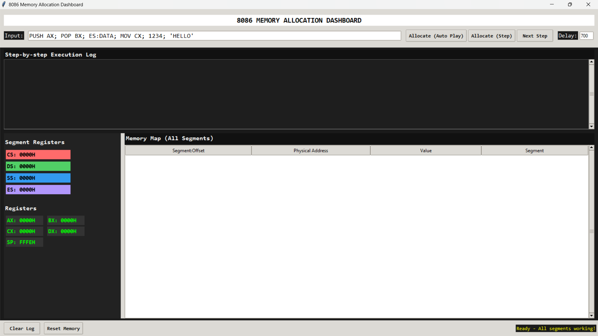
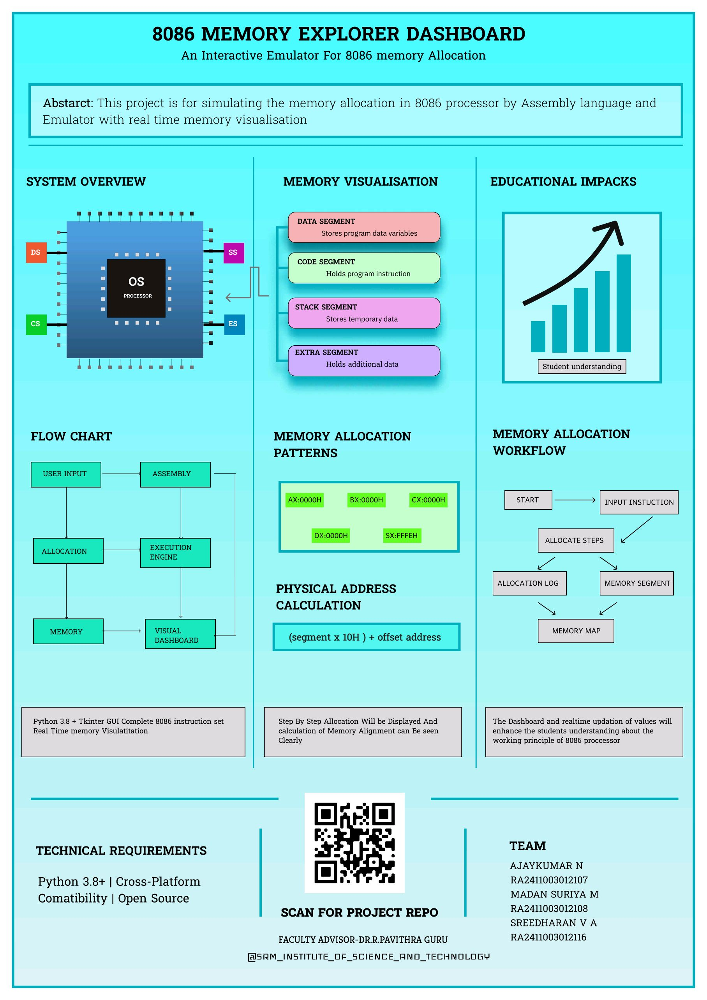

# Memory-Explorer-Dashboard
__COA PROJECT SIMULATING 8086 MEMORY  ALLOCATION__
 
 

 
 

__STEP BY STEP ALLOCATION__
 
 

 
 

__POSTER__
 

 

 
 
__TOOLS USED__
*Text Editor* - visual studio
*GUI,POSTER* - Figma
